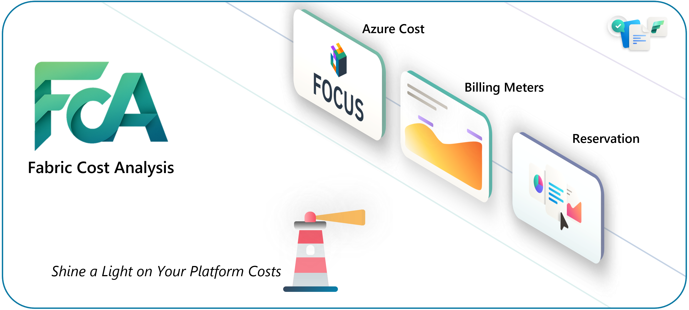
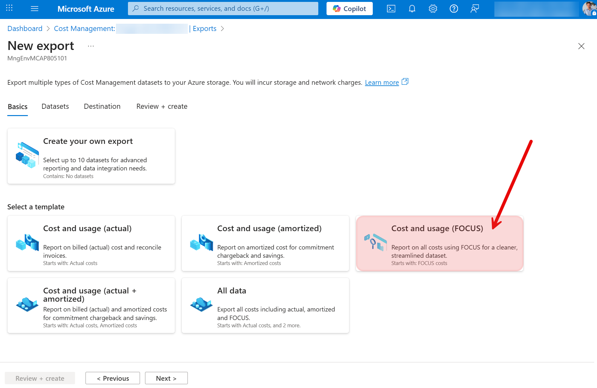
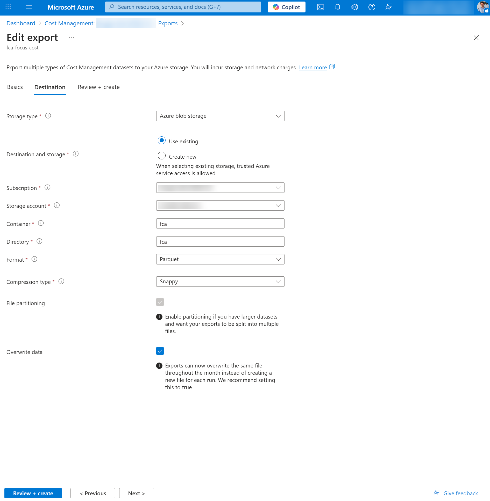
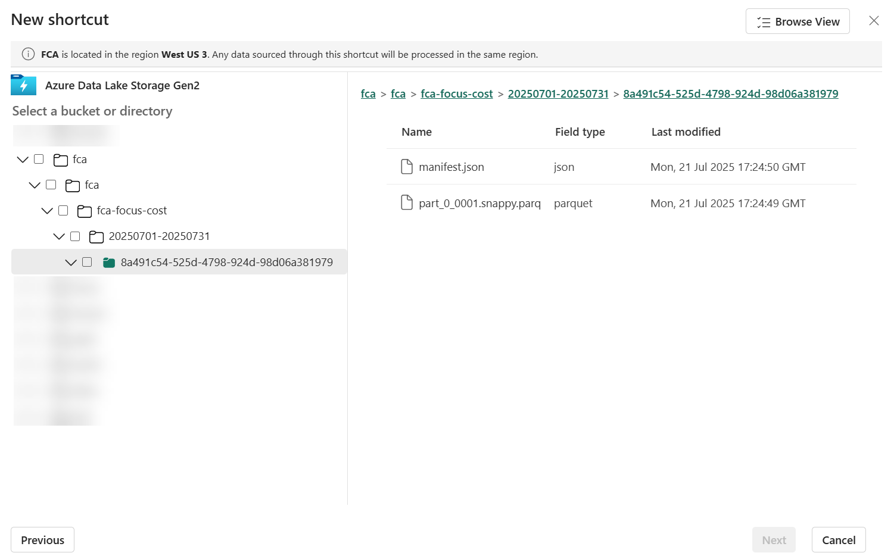
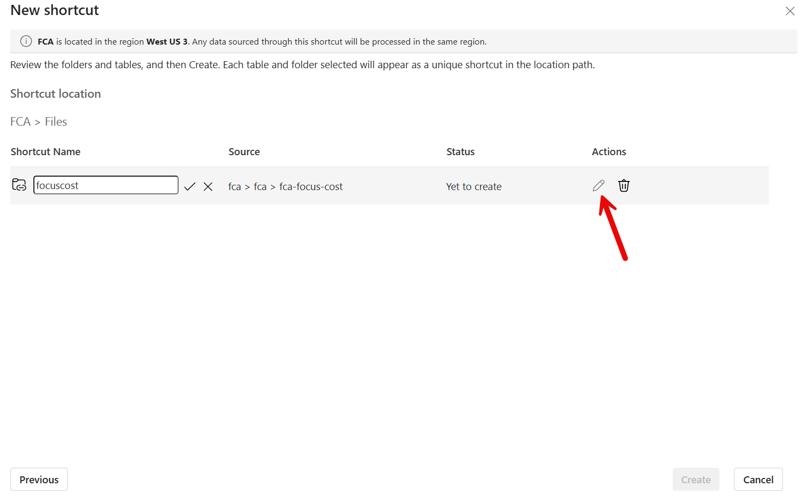
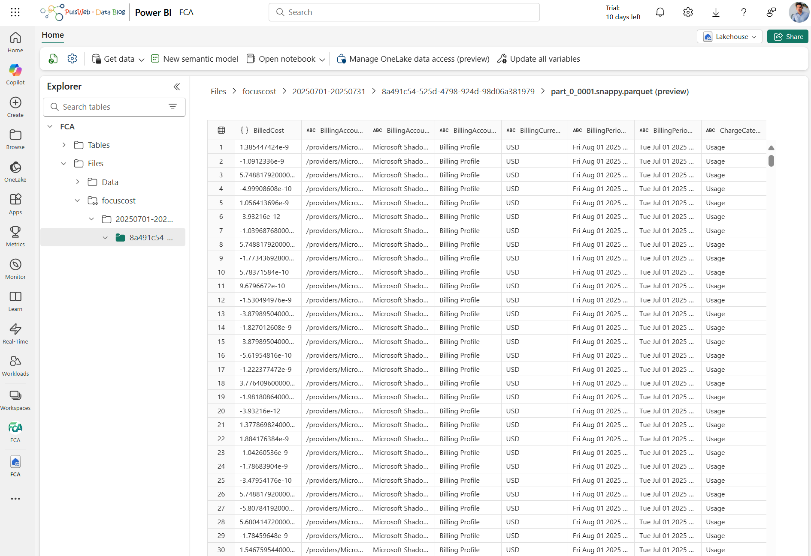

# **Solution accelerator for Fabric platform to monitor cost**

The solution aims to facilitate the understanding and monitoring of the Microsoft Fabric Cost.

Customers may not always clearly distinguish between costs that are included or excluded within the Data Platform, the handling of reservations (particularly those not rationalized within a defined scope), or their capacity usage. They may also need guidance on strategies for optimizing resources and implementing effective FinOps practices, including chargeback and show back to stakeholders. This free solution was developed in France by several passionate CSA experts in FinOps and Data: [Cedric Dupui](https://www.linkedin.com/in/cdupui/), [Manel Omani](https://www.linkedin.com/in/mlomani/), [Antoine Richet](https://www.linkedin.com/in/antoine-richet-22a44021/), and led by [Romain Casteres](https://www.linkedin.com/in/casteres/) inspired by his Blog article [FinOps for Microsoft Fabric](https://www.linkedin.com/pulse/finops-microsoft-fabric-romain-casteres-hc6ee/?trackingId=xFSs0xHqR0OheUQ7Tqn9mw%3D%3D).

## Introduction

Fabric Cost Analysis (short: FCA) is a solution to enable holistic monitoring of Microsoft Fabric Cost with the help of Microsoft Fabric.

FSA has the goal to provide a more holistic view specified on Microsoft Fabric aspect and particularities (joining Financial and Operational forces) on top of the various information, which can be extracted from Azure Cost Management, personal enriched source of information, … allowing its users to analyze at a very high level, but also to deep dive into specific usage, reservation and particularity of the platform for a more fine granular data analysis. 

FCA is fully developed utilizing Fabric capabilities, with Pipelines and Notebooks serving as key tools for data extraction and transformation. Data is maintained both in its raw format and as Delta Parquet, allowing users to access it directly through Power BI Direct Lake. FCA includes standard reports that provide an overview of data and allow users to customize or create their own reports using the data model. Fabric's open framework enables integration with external data sources for further analysis as needed.

⚠️ Caution: The FCA solution accelerator is not an official Microsoft product! It is a solution accelerator, which can help you implement a cost monitoring solution within and for Fabric. Consequently, there is no official support provided, and there remains a potential risk of system failures.

## Content

### Architecture

IMAGE: ARCHITECTURE (Will be reused in the Support Page)

### FCA Inputs

FCA gathers diverse data in Lakehouse to provide cost insights:

- FCA extracts Azure Cost in [FOCUS](https://focus.finops.org/) format (a Unified Standard for Cloud Billing Data)
- FCA extracts Azure Reservations details
- FCA extracts enriched Microsoft Learn documentation data

### FCA Outputs

#### Report

| **#** | **Page** | **Info**                                                     |
| ----- | -------- | ------------------------------------------------------------ |
| **1** |          | Home Page  - Cost overview  - Cost per category  - Warnings  |
| **2** |          | Summary Page  - Capacities number  - Region number  - Cost per category / capacity |
| **3** |          | Usage Page  - Detail meters / capacity  - Usage info in regards of the ‘Compute  Pool Capacity Usage CU’ meter |
| **4** |          | Detail Page  - Detail cost per capacities  - Cost per category / capacity / dates |
| **5** |          | Reservation Page  - Reservation rate  - Capacities usage of the RI |
| **6** |          | Support Page  - Architecture  - Learnings  - Links           |

#### Data Agent

## Setup

Are you ready to try FCA? Let's follow these simple 5 steps:

### 1 - Configure export of FOCUS Data

To create an export (Create [Cost Management exports](https://learn.microsoft.com/en-us/azure/cost-management-billing/costs/tutorial-improved-exports#create-exports)), an Azure Data Lake Storage Gen2 will be required ([Create a storage account](https://learn.microsoft.com/en-us/azure/storage/blobs/create-data-lake-storage-account)).

ℹ️ FCA will retain only data related to fabric costs.

Once Data Lake Gen 2 storage account created here are the high levels steps to create an export:

- Sign in to the Azure portal at [https://portal.azure.com](https://portal.azure.com/), search for **Cost Management**.
- Select the required scope and select **Exports** in the left navigation menu.
- Select **+ Create**
- On the Basics tab, select the template = **Cost and usage (FOCUS)**

- On the Datasets tab, fill in **Export prefix** with "fca"
- On the Destination tab, select:
  - Storage type = **Azure blob storage**
  - Destination and storage = **Use existing**
  - Subscription = Your subscription
  - Storage account = Your storage account
  - Container = **fca**
  - Directory = **fca**
  - Format = **Parquet**
  - Compression type = **Snappy**
  - Overwrite data = **Enabled**

- On the Review + Create tab, select **Create**
- Run the export by selecting **Run now** on the export page

### 2 - Configure Fabric items

- Create a new workspace "FCA" (name can be changed), which is backed by a P or F-capacity
- Download the ([Workspace logo](https://github.com/Pulsweb/FCA/blob/main/media/FCA%20Logo%20Small.png)) and add the logo to the workspace
- Create a new Lakehouse "FCA" on the workspace ([Create a lakehouse in Microsoft Fabric](https://learn.microsoft.com/en-us/fabric/data-engineering/create-lakehouse))
- Create a new File Shortcut on the Lakehouse ([Create an Azure Data Lake Storage Gen2 shortcut](https://learn.microsoft.com/en-us/fabric/onelake/create-adls-shortcut))
  - Select the ellipsis (**...**) next to **Files**
  - Select **New shortcut**
  - Select Azure Data Lake Storage Gen 2 and provide the following settings:
    - URL = **Data Lake Storage** URL of the Data Lake storage account. To get the Data Lake Storage URL, view the storage account where the export created a directory and the FOCUS cost file. Under **Settings**, select **Endpoints**. Copy the URL marked as **Data Lake Storage** it should look like this: *https://###.dfs.core.windows.net*.
    - Connection = **Create a new connection**
    - Connection name = <*Any name of your choice*>
    - Authentication kind = **Organizational account**
    - Sign in when prompted and select the Shortcut target sub path **fca-focus-cost** and click on Next

- Rename the Shortcut to **focuscost** and click on Create

- Verify access to the data

### 3 - Run the Pipeline

- Download and import the **[Deploy_FCA.ipynb](https://github.com/Pulsweb/FCA/blob/main/script/Deploy_FCA.ipynb)** Notebook into your FCA workspace ([Import existing notebooks](https://learn.microsoft.com/en-us/fabric/data-engineering/how-to-use-notebook#import-existing-notebooks))
- Click "Run All" in the Notebook
- Navigate to your FCA Workspace and refresh the browser to view the newly created artifacts
- Open the **Load FCA E2E** Data pipeline and Run the Pipeline once

ℹ️ The pipeline can be scheduled for daily loads ([Scheduled data pipeline runs](https://learn.microsoft.com/en-us/fabric/data-factory/pipeline-runs#scheduled-data-pipeline-runs)).

### Support

The FCA solution accelerator template is not an official Microsoft service.

Ideas/Suggestions: Submit ideas and suggestions as issues in this repository.

Bug Reports: A backlog is maintained on the project issues page. If you encounter problems or have suggestions, add an entry to the issues section.

Important: Support tickets should not be opened for issues related to these templates. For any questions or concerns about the templates, create an issue in this repository.

### Other helpful resources

- Recorded Demo
- [Microsoft FinOps toolkit](https://learn.microsoft.com/en-us/cloud-computing/finops/toolkit/power-bi/help-me-choose#comparison-table)
- …
